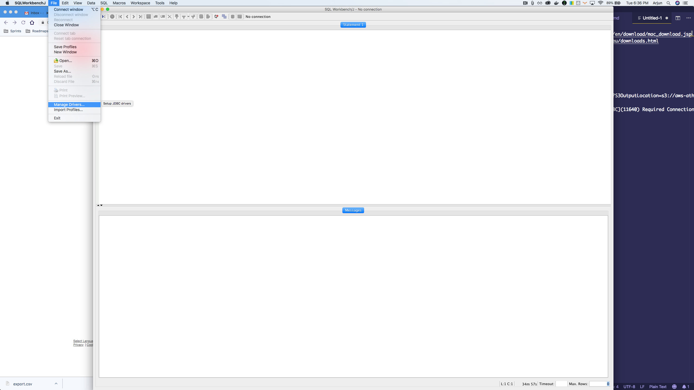
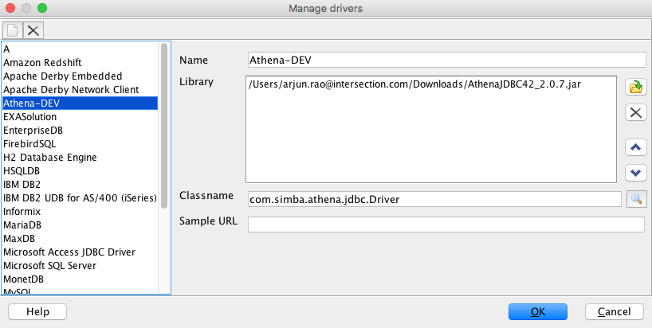
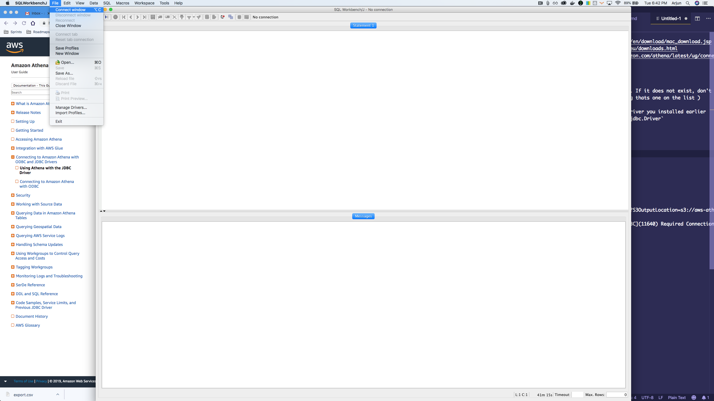
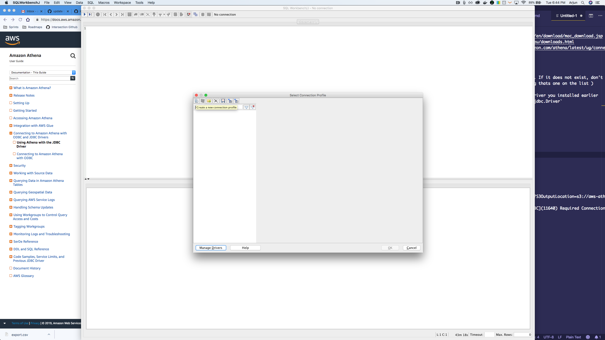
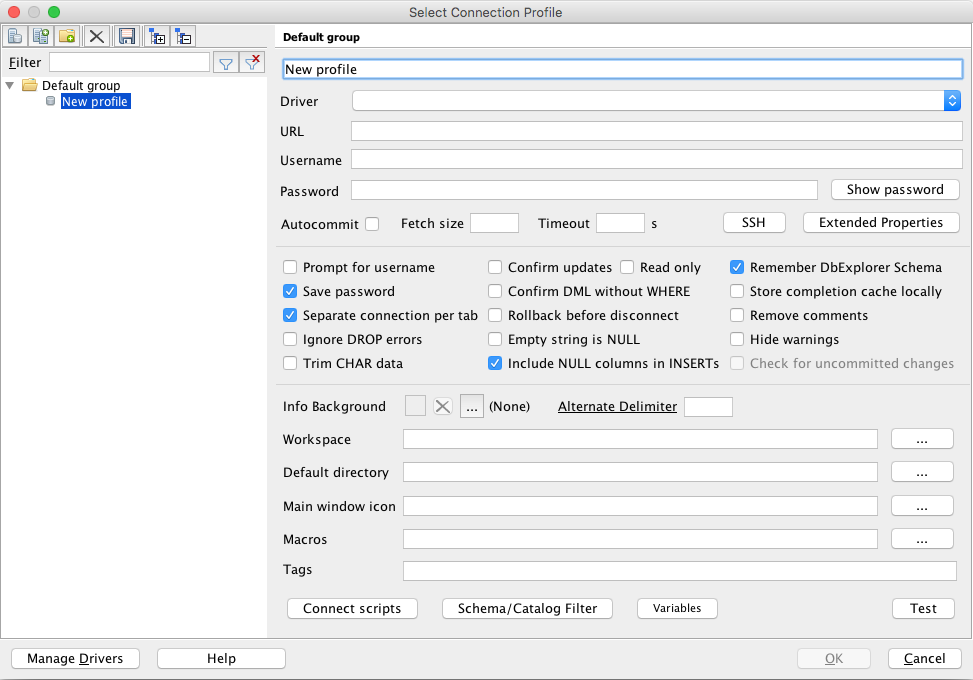
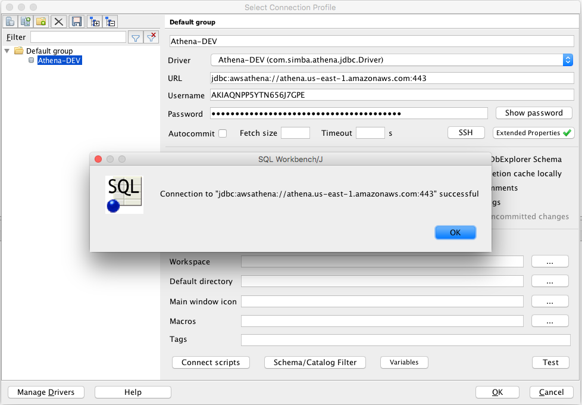

# Querying data from AWS Athena using SQL Workbench 

Using AWS Athena, you can run SQL on top of storage systems like S3. I wanted to connect Athena to a SQL IDE so that I could execute those queries. I chose SQL Workbench as the tool of choice. However, I didn't find up-to-date documentation on the setup process, as it stands today, so I decided to put together some notes for setting this up.

## Prerequisites
- Ensure you have Java installed - https://java.com/en/download/mac_download.jsp
    - :warning: *If you are using Windows/Linux, make sure you install the appropriate Java distro*
- Install SQL Workbench - http://www.sql-workbench.eu/downloads.html
- Download the Athena Driver - https://docs.aws.amazon.com/athena/latest/ug/connect-with-jdbc.html

## Setup the Athena Driver
- File -> Manage Drivers

- Select the Athena driver if available in the list. If it does not exist, don't worry. You can select any of the options and make it an Athena driver by following the next steps 
- Lets say you select the `Adabas` driver ( assuming thats one on the list )
    - Change the `Name` to `Athena-DEV`
    - In the `Library` section, upload the athena driver you installed earlier 
    - Change the `classname` to  `com.simba.athena.jdbc.Driver`
    - You can leave the `Sample URL` field empty
- Your final Driver setup should look like 

- Hit `OK` to save configuration

## Setup the Athena Connection
- File -> Connect Window

- Click the icon on the top left to `Create a new connection profile`

- You should have this as the view now

- Connection Name ( uppermost text box ) = `Athena-DEV`
- Driver = `Athena-DEV` in the dropdown ( since you already created the driver in the steps above )
- URL = `<your-athena-instance-based-on-region>` eg. `jdbc:awsathena://athena.us-east-1.amazonaws.com:443`
- Username = `<AWS_ACCESS_KEY_ID>`
- Password = `<AWS_SECRET_ACCESS_KEY>`
- Click the `Extended Properties` box and add a property `S3OutputLocation` as the key. For the value, use the Amazon S3 location where you would like to store the results of the queries, prefixed by s3://. Eg. If you have a bucket named `my-personal-bucket` and you want to store the results in a folder called `test-run`, then the value would be `s3://my-personal-bucket/test-run`
- Click OK
- Hit the `Test` button and you should be successfully connected to Athena in your region!

**You can now go ahead and query your S3 data out of Athena** 🔥
